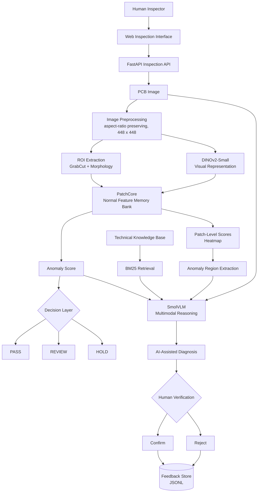
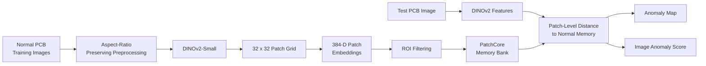
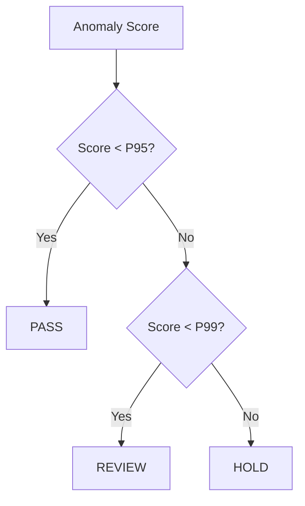
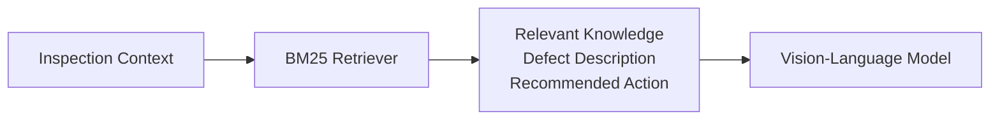
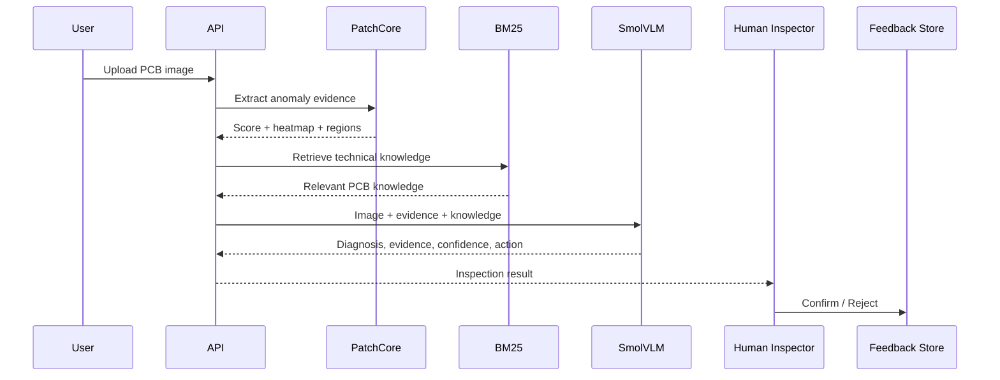
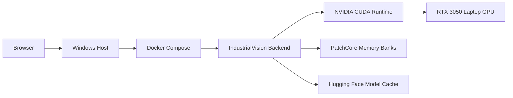

# IndustrialVision AI

### Agentic Multimodal PCB Inspection and Defect Diagnosis

> An end-to-end inspection system that combines **DINOv2 features, PatchCore anomaly detection, pixel-level localization, vision-language reasoning, knowledge retrieval, threshold-based decisions, and human-in-the-loop verification**.

[](https://www.python.org/)
[](https://pytorch.org/)
[](https://fastapi.tiangolo.com/)
[](https://www.docker.com/)
[](https://huggingface.co/)

| Mean Image AUROC | Mean Pixel AUROC | Dataset | Decisions |
|:---:|:---:|:---:|:---:|
| **0.9216** | **0.9526** | VisA PCB1-PCB4 | PASS / REVIEW / HOLD |

---

## Table of Contents

- [Overview](#overview)
- [Key Features](#key-features)
- [System Architecture](#system-architecture)
- [Machine Learning Pipeline](#machine-learning-pipeline)
- [Dataset](#dataset)
- [Results](#results)
- [Decision Engine](#decision-engine)
- [AI-Assisted Diagnosis](#ai-assisted-diagnosis)
- [Human-in-the-Loop](#human-in-the-loop)
- [Web Interface](#web-interface)
- [Backend API](#backend-api)
- [Getting Started](#getting-started)
- [Project Structure](#project-structure)
- [Reproducibility](#reproducibility)
- [Design Decisions](#design-decisions)
- [Limitations](#limitations)
- [Future Work](#future-work)
- [Responsible Use](#responsible-use)
- [Author](#author)

---

## Overview

Industrial inspection rarely asks *"which class is this image?"* It asks:

> **Does this part look different from normal production examples, where is the deviation, and what could explain it?**

IndustrialVision AI answers that in separate, inspectable stages instead of one opaque classifier:

1. **Model normal appearance** with DINOv2 patch features and a PatchCore memory bank.
2. **Detect and localize** deviations with an image-level score and a pixel-level heatmap.
3. **Decide** with calibrated percentile thresholds: `PASS`, `REVIEW`, or `HOLD`.
4. **Diagnose** with a vision-language model (SmolVLM) that sees the image, the anomaly evidence, and retrieved technical knowledge.
5. **Verify** with a human inspector whose confirm/reject feedback is stored for later evaluation.

The system is designed to *assist* inspectors, not replace them. See [Responsible Use](#responsible-use).

---

## Key Features

- **Unsupervised anomaly detection.** Trained only on normal PCB images, with no defect labels required.
- **Spatial localization.** 32 x 32 patch-level anomaly maps rather than a single image score.
- **ROI-aware scoring.** GrabCut and morphology isolate the PCB and suppress background influence.
- **Category-specific memory banks and thresholds** for each PCB type.
- **Multimodal diagnosis.** Likely defect, visual evidence, confidence, and recommended action.
- **Retrieval-grounded reasoning.** BM25 over a PCB knowledge base: transparent, deterministic, no paid API.
- **Human verification loop.** Confirm/reject feedback persisted to JSONL with aggregate statistics.
- **Deployable.** FastAPI backend, browser UI, Docker Compose with NVIDIA GPU support.

---

## System Architecture



---

## Machine Learning Pipeline



### Visual representation

| Setting | Value |
|---|---|
| Backbone | `facebook/dinov2-small` |
| Features used | Patch tokens (not CLS), to preserve spatial information |
| Input | Aspect-ratio-preserving resize, padded to 448 x 448 |
| Patch grid | 32 x 32 = 1024 patches x 384 dimensions |
| Cropping | No center crop, because defects can occur anywhere on the board |

### ROI-aware processing

```text
Downscaled image -> GrabCut -> Morphological closing/opening
                 -> Largest contour -> Expanded bounding box -> 32 x 32 ROI mask
```

The ROI mask focuses memory-bank construction and scoring on the PCB itself. This reduced background influence and improved pixel-level anomaly performance.

### PatchCore configuration

| Parameter | Value |
|---|---|
| Sampling | Coreset sampling, 1% ratio |
| Candidate limit | 50,000 patches |
| Scoring | k-nearest-neighbor feature distance |
| Memory banks | One per PCB category |
| Random seed | 42 |

---

## Dataset

The project uses the official [VisA](https://github.com/amazon-science/spot-diff) (Visual Anomaly) dataset with its **official train/test split**. No random re-splitting is introduced. Primary experiments use PCB1-PCB4.

| Category | Train Normal | Test Normal | Test Anomaly |
|---|---:|---:|---:|
| PCB1 | 904 | 100 | 100 |
| PCB2 | 901 | 100 | 100 |
| PCB3 | 905 | 101 | 100 |
| PCB4 | 904 | 101 | 100 |
| **Total** | **3614** | **402** | **400** |

All 400 anomalous test samples have valid ground-truth masks.

---

## Results

Final 448 x 448 ROI-aware PatchCore pipeline:

| Category | Image AUROC | Pixel AUROC |
|---|:---:|:---:|
| PCB1 | 0.9504 | 0.9767 |
| PCB2 | 0.9022 | 0.9218 |
| PCB3 | 0.8917 | 0.9461 |
| PCB4 | 0.9423 | 0.9659 |
| **Mean** | **0.9216** | **0.9526** |

### Localization

The dense heatmap is the primary localization signal. Candidate regions are derived from it by post-processing:

```text
Patch scores -> Normalize -> Heatmap -> 95th-percentile threshold
             -> Morphological processing -> Connected components -> Candidate regions
```

The mean best-region IoU of these rectangular regions is **0.1870**. This is much weaker than the pixel AUROC of the underlying heatmap, so the region-extraction step is the current bottleneck for localization, not the anomaly maps. It is reported openly as a limitation.

---

## Decision Engine

Scores are converted into operational decisions using category-specific percentiles of **normal training scores**.



| Category | P95 (Review) | P99 (Hold) |
|---|---:|---:|
| PCB1 | 29.4933 | 33.0930 |
| PCB2 | 26.7620 | 29.2746 |
| PCB3 | 27.3393 | 31.3704 |
| PCB4 | 28.0614 | 30.6726 |

| Decision | Meaning |
|---|---|
| **PASS** | The sample is sufficiently similar to normal training examples. |
| **REVIEW** | The image contains suspicious visual evidence and should be inspected by a human. |
| **HOLD** | The anomaly score is high enough to require immediate human investigation. |

> These are reproducible **research thresholds**, not production-certified quality-control thresholds.

---

## AI-Assisted Diagnosis

PatchCore answers *"where does the image look anomalous?"* It does not say *"what kind of defect is this?"* A second stage therefore uses a vision-language model.

**Inputs:** original PCB image, anomaly score, heatmap and detected regions, and retrieved technical knowledge.

**Outputs:** `LIKELY DEFECT`, `VISUAL EVIDENCE`, `CONFIDENCE`, `RECOMMENDED ACTION`.

### Technical knowledge retrieval

Before generating a diagnosis, the agent retrieves relevant entries from a PCB-specific knowledge base using **BM25** (`rank-bm25`). Retrieved defect descriptions and recommended actions are passed to the VLM as context, so it does not rely only on pretrained knowledge.



> The VLM is an **assistive reasoning component**, not a certified industrial classifier. Its output can be wrong.

---

## Human-in-the-Loop



Feedback is persisted to `data/inference/feedback.jsonl` and summarized at `GET /feedback/stats`. It is stored for evaluation, not used to retrain the model automatically. It lays the groundwork for disagreement analysis, threshold calibration, active learning, and human-AI performance comparison.

---

## Web Interface

A lightweight browser UI (`frontend/index.html`) provides:

- PCB category selection and image upload
- Anomaly score, decision, and confidence
- Anomaly heatmap overlay
- AI defect diagnosis (likely defect, evidence, confidence, recommended action)
- Retrieved technical knowledge
- Confirm / Reject verification buttons

<!-- Add screenshots here, e.g.:

-->

---

## Backend API

FastAPI service; interactive docs at `http://localhost:8000/docs`.

| Endpoint | Method | Purpose |
|---|:---:|---|
| `/health` | GET | Backend status, CUDA availability, inference device, supported categories, loaded models |
| `/inspect` | POST | Input `image` + `category`. Returns anomaly score, decision, confidence, detected regions, heatmap, model info |
| `/diagnose` | POST | Combines image, PatchCore evidence, regions, and retrieved knowledge into an AI-assisted diagnosis |
| `/feedback` | POST | Stores a human `confirmed` or `rejected` verdict |
| `/feedback/stats` | GET | Aggregate verification statistics |

---

## Getting Started

### Prerequisites

- Python 3.12
- NVIDIA GPU with CUDA recommended (CPU works but is slower)
- PyTorch installed with the CUDA build matching your driver

### Install

```bash
git clone https://github.com/anuja2024/industrialvision-ai.git
cd industrialvision-ai

python -m venv .venv
# Windows (PowerShell)
.venv\Scripts\Activate.ps1
# Linux / macOS
# source .venv/bin/activate

pip install -r requirements.txt
```

### Run the backend

```bash
python -m uvicorn app.api.main:app --reload
```

Backend: `http://localhost:8000`  |  API docs: `http://localhost:8000/docs`

### Run with Docker (GPU)

```bash
docker compose build
docker compose up
```

Then check `GET /health` to confirm GPU availability and model loading.



### Hardware used for development

| Component | Spec |
|---|---|
| CPU | Intel Core i5-12450HX |
| GPU | NVIDIA RTX 3050 Laptop, 6 GB |
| RAM | 16 GB |
| OS | Windows |
| Python / CUDA | 3.12.10 / 13.0 |

GPU acceleration is used for DINOv2 and VLM inference.

---

## Project Structure

```text
industrialvision-ai/
├── app/
│   ├── agents/          # diagnosis_agent.py
│   ├── api/             # main.py (FastAPI)
│   ├── data/            # audit, config, dataset, downloader, validator, visualization
│   ├── evaluation/      # PatchCore metrics, localization + PatchCore visualizations
│   ├── inference/       # inspection_service.py, patchcore_inference.py
│   ├── models/          # build_patchcore.py, dinov2.py, patchcore.py
│   ├── retrieval/       # BM25 technical knowledge retrieval
│   └── verification/    # human feedback handling
├── configs/             # dataset.yaml
├── data/                # raw/, features/, inference/, visualizations/
├── docker/              # Dockerfile
├── frontend/            # index.html
├── tests/
├── docker-compose.yml
├── pyproject.toml
├── requirements.txt
└── README.md
```

---

## Reproducibility

- Official VisA split, fixed PCB categories (PCB1-PCB4)
- Deterministic candidate sampling with random seed `42`
- Explicit PatchCore configuration and category-specific memory banks
- Saved feature tensors
- Percentile thresholds computed from normal training scores

---

## Design Decisions

| Question | Decision and rationale |
|---|---|
| **Why DINOv2?** | Strong pretrained representations with no defect labels, which matters when defective samples are scarce. |
| **Why PatchCore?** | It models the distribution of normal appearance, which fits anomaly detection better than forcing every defect into a fixed class taxonomy. |
| **Why patch-level features?** | Defects are often small and local. Patch features yield an anomaly map, not just an image label. |
| **Why ROI-aware processing?** | Removes irrelevant background from scoring and improved pixel-level evaluation. |
| **Why a VLM?** | PatchCore gives evidence, not semantics. The VLM adds a reasoning layer over image plus evidence. |
| **Why BM25?** | The knowledge base is small and domain-specific. BM25 is transparent, deterministic, cheap, and needs no embedding service. |
| **Why human-in-the-loop?** | Inspection errors have operational and financial cost, especially in REVIEW and HOLD cases. |

---

## Limitations

This is a **research and portfolio system**, not a production-certified inspection system.

1. VLM diagnoses can be incorrect.
2. The confidence score is heuristic, not a calibrated probability.
3. Rectangular region extraction (mean best-region IoU 0.1870) is weaker than the underlying heatmap.
4. The technical knowledge base is intentionally small.
5. Primary experiments cover only PCB1-PCB4 from VisA.
6. Thresholds are percentile-based, not optimized against production cost functions.
7. Not validated on real manufacturing-line imagery.
8. Real deployment would need controlled cameras, lighting, calibration, and process validation.
9. Human feedback is stored for evaluation and does not automatically retrain the model.

---

## Future Work

- **Vision:** better segmentation and region proposals, multi-scale PatchCore, higher-resolution features, category-independent detection
- **Multimodal reasoning:** stronger open-source VLMs, structured diagnosis output, calibrated uncertainty, visual evidence grounding
- **Retrieval:** hybrid BM25 + dense retrieval, vector database, technical-document ingestion, evidence ranking
- **Agentic workflow:** separate perception, diagnosis, retrieval, verification, and evaluation agents; automated inspection reports
- **Human feedback:** reviewer agreement metrics, disagreement analysis, threshold calibration, active learning
- **Engineering:** experiment tracking, model versioning, monitoring, CI/CD, regression tests

---

## Responsible Use

IndustrialVision AI is an AI-assisted inspection tool. Its outputs are not guaranteed quality decisions.

```text
AI Detection -> AI Reasoning -> Evidence -> Human Review -> Final Inspection Decision
```

---

## Author

**Anuja Patade**, M.Sc. Data Science, TU Dortmund University

Interests: machine learning, computer vision, multimodal AI, generative AI, retrieval-augmented generation, industrial AI

GitHub: [@anuja2024](https://github.com/anuja2024)

---

<p align="center">
<b>IndustrialVision AI</b> = Perception + Anomaly Detection + Reasoning + Retrieval + Decision Support + Human Feedback
</p>
